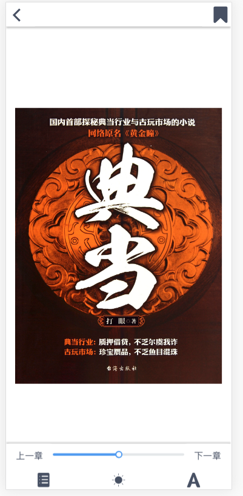

# books

一款基于vue-cli3开发的书城类pwa网站，主要功能有商城、排行榜、电子书阅读、电子书更改字号等相关设置、电子书购买、充值等（部分功能尚未完善，正在不断更新）

采用技术有 epubjs、axios、iview、vue-route、vuex、localforage等

配套后台为koa-book

## Project setup
```
npm install
```

### Compiles and hot-reloads for development
```
npm run serve
```

### Compiles and minifies for production
```
npm run build
```

### Run your tests
```
npm run test
```

### Lints and fixes files
```
npm run lint
```

### Customize configuration
See [Configuration Reference](https://cli.vuejs.org/config/).

#预览图片


#

#

#

#

